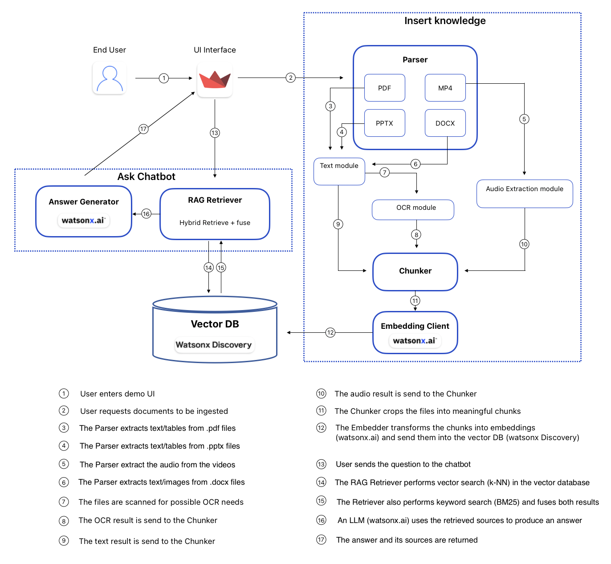

# DeepSea Pythia RAG Demo

DeepSea is a retrieval-augmented question answering (RAG) system tailored for the Pythia platform. It combines an ingestion pipeline for mixed-format documents, an Elasticsearch-powered hybrid retriever, and IBM watsonx large language models, all wrapped in a Streamlit chat experience.

- Chat UI with grounded answers sourced from your document corpus
- Automatic chunking, deduplication, OCR, and table extraction for PDFs, PPTX decks, DOCX files, Markdown, and plaintext
- Optional video/audio ingestion via Whisper ASR with intelligent segment merging
- Hybrid retrieval (vector + BM25) backed by Elasticsearch, powered by watsonx embeddings
- Docker setup for reproducible deployments

## Architecture at a Glance

| Layer | Purpose | Key Modules |
| --- | --- | --- |
| Streamlit app | Chat UI, upload dialog, conversation history | `main.py`, `app/qa.py`, `app/answer.py` |
| Retrieval | Hybrid semantic/lexical search over Elasticsearch | `app/retrieve.py`, `app/embedder.py` |
| Ingestion | File loaders, OCR, ASR, chunking, indexing | `ingest/` package, `utils/` helpers |
| Storage | Elasticsearch index + on-disk chunk snapshots | external ES cluster, `data/chunks/` |

The architecture of the system can be further explored in the diagram below:



## Prerequisites

- Python 3.10
- pip and virtualenv (or uv/poetry if you prefer)
- ffmpeg and poppler installed locally (needed when ingesting media/PDFs outside Docker)
- Access to an Elasticsearch 8.x cluster with API credentials
- IBM watsonx project with access to the chosen embedding and generation models
- (Optional) Docker & Docker Compose for containerized runs

## Setup

Clone the repository and install dependencies:

```bash
git clone https://github.com/<your-org>/DeepSea.git
cd DeepSea
python -m venv .venv
source .venv/bin/activate  # Windows: .venv\Scripts\activate
pip install --upgrade pip
pip install -r requirements.txt
python -m nltk.downloader punkt
```

Create a `.env` file in the project root with your credentials. Never commit real secrets; the example below shows the keys you need to supply:

```dotenv
WATSONX_BASE_URL=https://<region>.ml.cloud.ibm.com
WATSONX_API_KEY=<your-watsonx-api-key>
WATSONX_PROJECT_ID=<your-watsonx-project-id>
EMBED_MODEL=ibm/slate-125m-english-rtrvr
LLM_MODEL=ibm/granite-4-h-small

ES_HOST=https://<your-elastic-host>:<port>
ES_USERNAME=<elastic-username>
ES_PASSWORD=<elastic-password>
INDEX_NAME=deepsea

WHISPER_MODEL=small                         # optional overrides
WHISPER_DEVICE=auto
WHISPER_COMPUTE=auto
```

> Tip: store the `.env` securely (e.g., in a password manager) and avoid sharing it in issue trackers or commits.

## Create the Elasticsearch Index

Run once to provision the index with the correct dense vector mapping. The script pings watsonx to detect the embedding dimension automatically, so ensure your environment variables are loaded (activate the virtualenv and `source .env` if needed):

```bash
python -m ingest.create_index
```

If the index already exists, the script exits gracefully.

## Running the App

```bash
streamlit run main.py
```

Open the provided URL (defaults to <http://localhost:8501>) to use the chat experience. Use the sidebar to tweak the LLM temperature and the number of retrieved chunks, and click **Upload Files…** to ingest new documents directly from the UI.

Session state keeps chat history per browser tab. Use **New Chat** to clear the conversation and cached answers.

## Document Ingestion Options

### From the UI

- Click **Upload Files…**
- Drop PDFs, PPTX decks, DOCX, Markdown, plain text, or MP4 files
- The app chunks, embeds, and indexes them; resulting chunk JSON snapshots are saved under `data/chunks/` for inspection

### From a Script / CLI

You can ingest files in bulk by calling the ingestion helper directly (ensure your `.env` is loaded first):

```bash
python - <<'PY'
from ingest.embed_and_index import upload_files
upload_files([
    "data/raw/handbook.pdf",
    "data/raw/kickoff_deck.pptx",
])
PY
```

The ingestion pipeline handles:

- Boilerplate detection and deduplication to avoid redundant chunks
- Selective Docling RapidOCR on PDF pages and slide images when native text is sparse
- Markdown conversion for tables in PDFs and PPTX decks
- DOCX parsing with heading-aware chunking
- Faster-Whisper ASR for MP4/MP3 content with smart segment merging (`ingest/asr_whisper.py`)

## Docker Workflow (Optional)

The provided Dockerfile installs system dependencies (ffmpeg, poppler, Docling requirements) and boots Streamlit.

```bash
docker compose up --build
```

Bind mounts keep `data/` and `nltk_data/` persistent on the host. Update `.env` before starting the containers; Docker Compose forwards it into the app service.

## Project Structure

```
app/            # Chat orchestration, retrieval, Watsonx answer generation
ingest/         # File loaders, OCR/ASR integration, chunking, indexing helpers
utils/          # Hashing, storage, deduplication utilities
data/           # Persistent artifacts (chunks, uploaded docs, etc.)
main.py         # Streamlit entry point
docker-compose.yml / Dockerfile  # Container configuration
requirements.txt                 # Python dependencies
```

## Troubleshooting

- **Watsonx 401/403 errors:** verify your API key, project association, and that the selected models are enabled for the project.
- **Elasticsearch connection failures:** confirm the host URL, credentials, and that your IP is allowed to reach the cluster.
- **Ingestion stalls on media files:** ensure `ffmpeg` is installed locally, or run inside the Docker container where it is available.
- **Streamlit fails to start due to NLTK data:** rerun `python -m nltk.downloader punkt` (the Docker image does this automatically).

## Contributing

Issues and pull requests are welcome. Please include clear reproduction steps and avoid sharing secrets in the issue body. For large feature work, open a proposal in advance so we can align on the direction.
